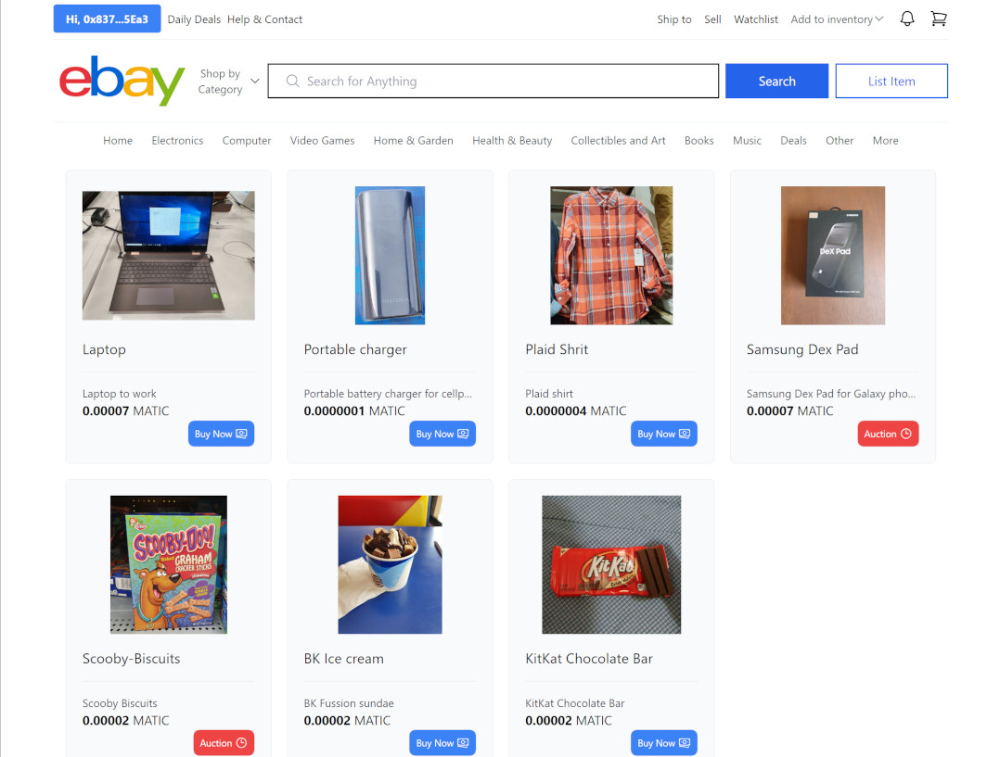

# EBay-react + ThirdWeb

eBay-like portal. Demo page similar to eBay UI that simulates the purchase and sale procedure but with NFTs instead of items and cryptocurrency instead of money. Users can log in using their Metamask crypto wallet account. Once logged in, the user can start mining ("Add to Inventory" option) and list their NFTs with the options of "Buy Now" or list them as an "Auction". Then users can purchase or bid the listed items.

See it in action: https://ebay-react-thirdweb.vercel.app

## Screenshots:

<div align="center">
  
</div>

## Technologies:

This example shows how to use the following technologies, components and services:
- [React.js](https://reactjs.org/), the best JavaScript library for building user interfaces.
- [Next.js](https://nextjs.org/), one of the best and complete framework for react.js application.
- [Vercel](https://vercel.com/) free account to deploy and host the application.
- [Tailwind CSS](https://tailwindcss.com/).
- [Thirdweb react SDK](https://portal.thirdweb.com/react) to test the usage of NFTs and cryptocurrencies transactions in React.
- [Heroicons](https://heroicons.com).
- [React-hot-toast](https://react-hot-toast.com/), one of the best notification and easy to use component for react.

## Disclaimer

This is only a demo application with the intention of testing and practicing the latest Next.js framework feactures for React as well as for testing the [Thirdweb react SDK](https://portal.thirdweb.com/react).

## Deploy your own

Deploy the example using [Vercel](https://vercel.com?utm_source=github&utm_medium=readme&utm_campaign=next-example) or preview live with [StackBlitz](https://stackblitz.com/github/vercel/next.js/tree/canary/examples/with-tailwindcss)

[](https://vercel.com/new/git/external?repository-url=https://github.com/vercel/next.js/tree/canary/examples/with-tailwindcss&project-name=with-tailwindcss&repository-name=with-tailwindcss)

## How to use

Execute [`create-next-app`](https://github.com/vercel/next.js/tree/canary/packages/create-next-app) with [npm](https://docs.npmjs.com/cli/init), [Yarn](https://yarnpkg.com/lang/en/docs/cli/create/), or [pnpm](https://pnpm.io) to bootstrap the example:

```bash
npx create-next-app --example with-tailwindcss with-tailwindcss-app
```

```bash
yarn create next-app --example with-tailwindcss with-tailwindcss-app
```

```bash
pnpm create next-app --example with-tailwindcss with-tailwindcss-app
```

Deploy it to the cloud with [Vercel](https://vercel.com/new?utm_source=github&utm_medium=readme&utm_campaign=next-example) ([Documentation](https://nextjs.org/docs/deployment)).
