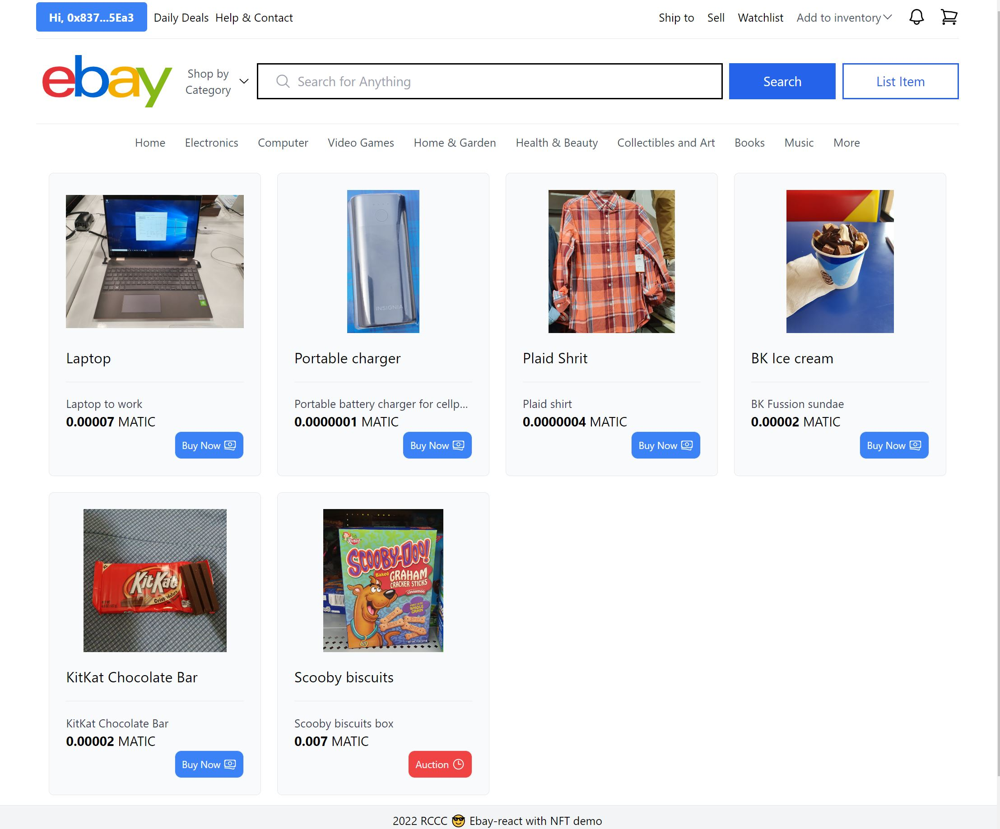

# EBay-react + ThirdWeb

EBay-like portal. Demo page similar to eBay UI that simulates the purchase and sale procedure but with NFTs instead of items and cryptocurrency instead of money. Users can log in using their Metamask crypto wallet account. Once logged in, the user can start mining ("Add to Inventory" option) and list their NFTs with the options of "Buy Now" or list them as an "Auction". Then users can purchase or bid the listed items.

Try it out at: https://ebay-react-thirdweb.vercel.app

## Screenshots:

<div align="center">
  
</div>

## Technologies:

This example shows how to use the following technologies, components and services:
- [React.js](https://reactjs.org/), the best JavaScript library for building user interfaces.
- [Next.js](https://nextjs.org/), one of the best and complete framework for react.js application.
- [Vercel](https://vercel.com/) free account to deploy and host the application.
- [Tailwind CSS](https://tailwindcss.com/).
- [Thirdweb react SDK](https://portal.thirdweb.com/react) to test the usage of NFTs and cryptocurrencies transactions in React.
- [Heroicons](https://heroicons.com).
- [React-hot-toast](https://react-hot-toast.com/), one of the best notification and easy to use component for react.

## Disclaimer

This is only a demo application with the intention of testing and practicing the latest Next.js framework feactures for React as well as for testing the [Thirdweb react SDK](https://portal.thirdweb.com/react).

## Step by Step Setup & Deployment Instructions from scratch

1. Create the app in a terminal window and install with the official tailwind css example which includes typescript by default:
    ```bash
    npx create-next-app -e with-tailwindcss ebay-react
    ```
2. Install [thirdweb react sdk](https://portal.thirdweb.com/react)
    ```bash
    npm install @thirdweb-dev/react @thirdweb-dev/sdk ethers
    ```
3. Configure the thirdweb provider at the root of the application as described in https://portal.thirdweb.com/react. Note: The file to modify is "_app.tsx"
4. Install heroicons from heroicons.com
    ```bash
    npm install @heroicons/react
    ```
5. Create the .env.local file to save the environment variables. This file will contain the addresses of the marketplace and nft collection so that we can test the application locally.
6. Upload to Github and deploy to Vercel.
    
    6.1. Create the github repository ebay-react-thirdweb.
    
    6.2. In Vercel, click add new project and select the just created github project from the list by selecting the option to import from github.
    
        - In the options above the "Deploy" button there is one for setting up the environment variables. In that option add the variales saved in the .env.local file and their corresponding values.
        - Click deploy and if everything was right, we'll get a link to the deployed version.
7. Install react-countdown to display the auction remaining time: react-countdown npm

    ```bash
    npm install react-countdown
    ```
8. Install react-hot-toast. See documentation at https://react-hot-toast.com/
    
    ```bash
    npm i react-hot-toast
    ```
    
 For more info on how to deploy to the cloud with [Vercel](https://vercel.com/new?utm_source=github&utm_medium=readme&utm_campaign=next-example) see ([Documentation](https://nextjs.org/docs/deployment)).
